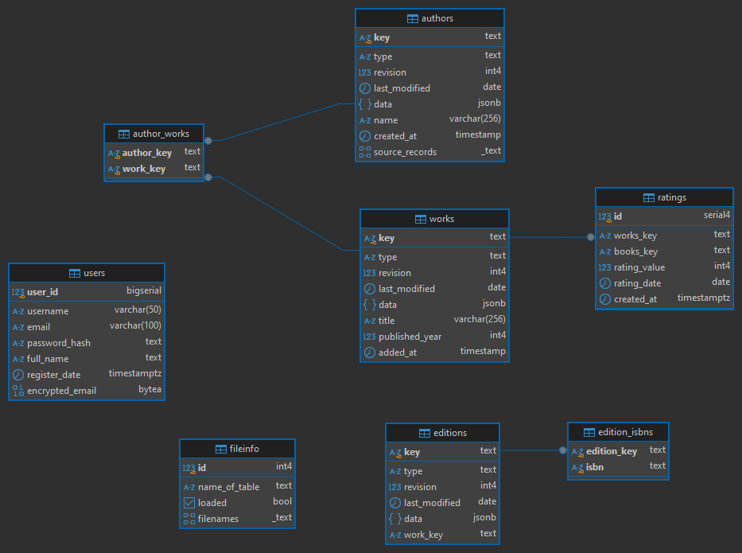

# Open Library database

Данные я взял с Open Library [data dumps](https://openlibrary.org/developers/dumps)

Примерно такие данные они предоставляют:

- Editions (~9GB)
- Works (~2.5GB)
- Authors (~0.5GB)
- All types (~10GB)


### Processing the data

Данные там грязноватые, поэтому надо их очистить, делается это с помощью файла [data_processing.py](data_processing.py).

```console
python data_processing.py
```

Он генерит несколько чистых файлов в папке `data/processed`.


### Import into database

Импорт я делаю со скрипта, который стартует вместе с первым запуском докер контейнера. Он выполняет в нужном порядке набор других скриптов для каждой таблицы.

### Database details

По итогу получается такая база (я еще немного ручками крутил):




editions ~50 млн записей\
users ~5млн\
works ~22млн\
authors ~14млн\
authors_works ~23млн

### Indexes


*B-tree*

``` sql
EXPLAIN ANALYZE 
SELECT (*) FROM works 
WHERE published_year 
BETWEEN 2010 AND 2017;
```


``` sql
Seq Scan on works  (cost=0.00..2350845.88 rows=2419226 width=713) (actual time=19.508..18145.228 rows=2428980 loops=1)
  Filter: ((published_year >= 2010) AND (published_year <= 2017))
  Rows Removed by Filter: 19544013
Planning Time: 1.030 ms
JIT:
  Functions: 2
  Options: Inlining true, Optimization true, Expressions true, Deforming true
  Timing: Generation 0.323 ms, Inlining 1.149 ms, Optimization 10.881 ms, Emission 6.957 ms, Total 19.310 ms
Execution Time: 18206.079 ms

```

Создаю индекс и тестирую (планировщику все равно, он выбрал последовательный скан)

``` sql
-- -- --
CREATE INDEX idx_works_published_year_btree ON works(published_year);
-- -- --

Seq Scan on works  (cost=0.00..2350845.88 rows=2419226 width=713) (actual time=28.694..11628.317 rows=2428980 loops=1)
  Filter: ((published_year >= 2010) AND (published_year <= 2017))
  Rows Removed by Filter: 19544013
Planning Time: 1.154 ms
JIT:
  Functions: 2
  Options: Inlining true, Optimization true, Expressions true, Deforming true
  Timing: Generation 1.602 ms, Inlining 2.274 ms, Optimization 12.940 ms, Emission 10.126 ms, Total 26.942 ms
Execution Time: 11683.073 ms
``` 

Вырубаю seq scan:

``` sql
-- -- --
SET enable_seqscan = OFF;
-- -- --


Bitmap Heap Scan on works  (cost=33653.84..2484127.72 rows=2468820 width=712) (actual time=218.556..3187.508 rows=2428980 loops=1)
  Recheck Cond: ((published_year >= 2010) AND (published_year <= 2017))
  Rows Removed by Index Recheck: 594252
  Heap Blocks: exact=32730 lossy=264908
  ->  Bitmap Index Scan on idx_works_published_year_btree  (cost=0.00..33036.64 rows=2468820 width=0) (actual time=196.004..196.004 rows=2428980 loops=1)
        Index Cond: ((published_year >= 2010) AND (published_year <= 2017))
Planning Time: 9.128 ms
JIT:
  Functions: 2
  Options: Inlining true, Optimization true, Expressions true, Deforming true
  Timing: Generation 0.226 ms, Inlining 1.935 ms, Optimization 10.997 ms, Emission 5.965 ms, Total 19.123 ms
Execution Time: 3234.880 ms
``` 

Использовал битовый скан индекса, что оказалось в 3-4 раза быстрее. 

Еще я попал в ситуацию, как сильно влияет width параметр на время выполнения, то есть вес полей, который я селекчу:
``` sql
-- -- --
EXPLAIN ANALYZE 
SELECT key, title, published_year -- taking only 2 fields
FROM works 
WHERE published_year BETWEEN 2010 AND 2017;
-- -- -- 

Seq Scan on works  (cost=0.00..2351209.12 rows=2468820 width=60) (actual time=31.884..13715.928 rows=2428980 loops=1)
  Filter: ((published_year >= 2010) AND (published_year <= 2017))
  Rows Removed by Filter: 19544013
Planning Time: 0.051 ms
JIT:
  Functions: 4
  Options: Inlining true, Optimization true, Expressions true, Deforming true
  Timing: Generation 0.266 ms, Inlining 1.428 ms, Optimization 17.231 ms, Emission 10.676 ms, Total 29.600 ms
Execution Time: 13780.831 ms


-- -- --
SET enable_seqscan = OFF;
EXPLAIN ANALYZE 
SELECT key, title, published_year 
FROM works 
WHERE published_year BETWEEN 2010 AND 2017;
-- -- -- 


Bitmap Heap Scan on works  (cost=33653.84..2484127.72 rows=2468820 width=60) (actual time=78.550..735.295 rows=2428980 loops=1)
  Recheck Cond: ((published_year >= 2010) AND (published_year <= 2017))
  Rows Removed by Index Recheck: 594252
  Heap Blocks: exact=32730 lossy=264908
  ->  Bitmap Index Scan on idx_works_published_year_btree  (cost=0.00..33036.64 rows=2468820 width=0) (actual time=45.705..45.705 rows=2428980 loops=1)
        Index Cond: ((published_year >= 2010) AND (published_year <= 2017))
Planning Time: 0.044 ms
JIT:
  Functions: 4
  Options: Inlining true, Optimization true, Expressions true, Deforming true
  Timing: Generation 0.204 ms, Inlining 1.100 ms, Optimization 17.200 ms, Emission 11.223 ms, Total 29.727 ms
Execution Time: 778.890 ms
``` 

Все из-за того, что у меня в таблице jsonb, text типы, которые много весят и их долго тащить с диска.


И пример точного поиска (b-tree сокращает время выполнения в 500 раз)

``` sql
-- -- -- 
explain analyze
select key, name
from authors 
where name = 'Kenneth R. Gray'
-- -- -- 


Gather  (cost=1000.00..949394.62 rows=2 width=40) (actual time=28.613..562.441 rows=2 loops=1)
  Workers Planned: 2
  Workers Launched: 2
  ->  Parallel Seq Scan on authors  (cost=0.00..948394.42 rows=1 width=40) (actual time=359.459..552.273 rows=1 loops=3)
        Filter: ((name)::text = 'Kenneth R. Gray'::text)
        Rows Removed by Filter: 4712473
Planning Time: 0.056 ms
JIT:
  Functions: 12
  Options: Inlining true, Optimization true, Expressions true, Deforming true
  Timing: Generation 0.565 ms, Inlining 53.310 ms, Optimization 47.932 ms, Emission 31.693 ms, Total 133.501 ms
Execution Time: 562.722 ms


-- -- -- 
CREATE INDEX idx_authors_name ON authors(name);
explain analyze
select key, name
from authors 
where name = 'Leonard Cyril James McNae'
-- -- -- 

Index Scan using idx_authors_name on authors  (cost=0.56..12.59 rows=2 width=40) (actual time=0.608..0.609 rows=1 loops=1)
  Index Cond: ((name)::text = 'Leonard Cyril James McNae'::text)
Planning Time: 9.171 ms
Execution Time: 0.779 ms
``` 

В общем, b-tree подходит для
- Точных совпадений
- Диапазонов
- Сортировки
- для Unique ограничений

---

*GIN*

Запрос для точного поиска по jsonb (направленность gin'a):
``` sql

-- -- --
EXPLAIN ANALYZE
SELECT * 
FROM works 
WHERE works."data" @> '{"title": "Residential Microgrids and Rural Electrifications"}';
-- -- --


Seq Scan on works  (cost=10000000000.00..10002295913.40 rows=2197 width=712) (actual time=14583.212..14583.253 rows=1 loops=1)
  Filter: (data @> '{"title": "Residential Microgrids and Rural Electrifications"}'::jsonb)
  Rows Removed by Filter: 21972992
Planning Time: 0.272 ms
JIT:
  Functions: 2
  Options: Inlining true, Optimization true, Expressions true, Deforming true
  Timing: Generation 0.131 ms, Inlining 1.627 ms, Optimization 9.617 ms, Emission 4.863 ms, Total 16.239 ms
Execution Time: 14583.423 ms


-- -- --
CREATE INDEX idx_works_data ON works USING gin(data);
-- -- --

Bitmap Heap Scan on works  (cost=10000000085.03..10000008679.34 rows=2197 width=712) (actual time=58.345..58.347 rows=1 loops=1)
  Recheck Cond: (data @> '{"title": "Residential Microgrids and Rural Electrifications"}'::jsonb)
  Heap Blocks: exact=1
  ->  Bitmap Index Scan on idx_works_data  (cost=0.00..84.48 rows=2197 width=0) (actual time=0.357..0.357 rows=1 loops=1)
        Index Cond: (data @> '{"title": "Residential Microgrids and Rural Electrifications"}'::jsonb)
Planning Time: 2.798 ms
JIT:
  Functions: 2
  Options: Inlining true, Optimization true, Expressions true, Deforming true
  Timing: Generation 5.932 ms, Inlining 6.403 ms, Optimization 30.581 ms, Emission 20.845 ms, Total 63.760 ms
Execution Time: 65.126 ms
``` 

Сам gin работает на том, что сопоставляет значения с их местоположением в таблице. Хорош в поиске
- Составных типов - jsonb, массивах
- Полнотекст

---

*BRIN*

Тут я делаю поиск на диапазоне книг, вышедших от 10 до 17го года.

``` sql
-- -- --
EXPLAIN ANALYZE
SELECT * FROM works 
WHERE published_year BETWEEN 2010 AND 2017
ORDER BY published_year;
-- -- --


Index Scan using idx_works_published_year_btree on works  (cost=0.44..6388725.67 rows=2466102 width=712) (actual time=0.558..6265.101 rows=2428980 loops=1)
  Index Cond: ((published_year >= 2010) AND (published_year <= 2017))
Planning Time: 0.072 ms
JIT:
  Functions: 2
  Options: Inlining true, Optimization true, Expressions true, Deforming true
  Timing: Generation 0.458 ms, Inlining 0.000 ms, Optimization 0.000 ms, Emission 0.000 ms, Total 0.458 ms
Execution Time: 6317.695 ms


-- btree off

Sort  (cost=10004296067.85..10004300718.80 rows=1860380 width=712) (actual time=78385.077..78641.481 rows=1818026 loops=1)
  Sort Key: published_year
  Sort Method: external merge  Disk: 1321288kB
  ->  Bitmap Heap Scan on works  (cost=10000000742.13..10002347323.63 rows=1860380 width=712) (actual time=108.195..76899.499 rows=1818026 loops=1)
        Recheck Cond: ((published_year >= 2011) AND (published_year <= 2017))
        Rows Removed by Index Recheck: 15261767
        Heap Blocks: lossy=1569411
        ->  Bitmap Index Scan on idx_works_published_year_brin  (cost=0.00..277.04 rows=4436815 width=0) (actual time=49.103..49.103 rows=15694110 loops=1)
              Index Cond: ((published_year >= 2011) AND (published_year <= 2017))
Planning Time: 0.098 ms
JIT:
  Functions: 2
  Options: Inlining true, Optimization true, Expressions true, Deforming true
  Timing: Generation 0.185 ms, Inlining 7.146 ms, Optimization 28.861 ms, Emission 22.291 ms, Total 58.483 ms
Execution Time: 78755.930 ms


-- btree & brin off

Sort  (cost=10004299590.09..10004304241.04 rows=1860380 width=712) (actual time=12276.833..12532.901 rows=1818026 loops=1)
  Sort Key: published_year
  Sort Method: external merge  Disk: 1321296kB
  ->  Seq Scan on works  (cost=10000000000.00..10002350845.88 rows=1860380 width=712) (actual time=1003.016..10805.144 rows=1818026 loops=1)
        Filter: ((published_year >= 2011) AND (published_year <= 2017))
        Rows Removed by Filter: 20154967
Planning Time: 0.071 ms
JIT:
  Functions: 2
  Options: Inlining true, Optimization true, Expressions true, Deforming true
  Timing: Generation 0.206 ms, Inlining 1.100 ms, Optimization 9.667 ms, Emission 6.032 ms, Total 17.005 ms
Execution Time: 12649.705 ms
``` 

Пример неудачного использования, ибо brin хорош на данных, которые хранятся в таблице в +- сортированном виде, так как он работает на том, что для каждого блока (страницы хранит min & max значение), а у меня там все перемешано, так что seq scan и b-tree сильно лучше здесь.

``` sql
-- -- --
EXPLAIN ANALYZE
SELECT * FROM works
WHERE added_at >= NOW() - INTERVAL '1 year'
ORDER BY added_at DESC;
-- -- -- 


Gather Merge  (cost=10002182514.69..10002182723.78 rows=1792 width=712) (actual time=18230.024..18237.756 rows=0 loops=1)
  Workers Planned: 2
  Workers Launched: 2
  ->  Sort  (cost=10002181514.67..10002181516.91 rows=896 width=712) (actual time=18168.763..18168.764 rows=0 loops=3)
        Sort Key: added_at DESC
        Sort Method: quicksort  Memory: 25kB
        Worker 0:  Sort Method: quicksort  Memory: 25kB
        Worker 1:  Sort Method: quicksort  Memory: 25kB
        ->  Parallel Seq Scan on works  (cost=10000000000.00..10002181470.73 rows=896 width=712) (actual time=18168.517..18168.517 rows=0 loops=3)
              Filter: (added_at >= (now() - '1 year'::interval))
              Rows Removed by Filter: 7324331
Planning Time: 0.066 ms
JIT:
  Functions: 6
  Options: Inlining true, Optimization true, Expressions true, Deforming true
  Timing: Generation 0.885 ms, Inlining 56.460 ms, Optimization 39.058 ms, Emission 26.812 ms, Total 123.214 ms
Execution Time: 18237.995 ms


-- -- -- 
SET enable_seqscan = OFF;
-- -- -- 


Sort  (cost=10000021798.58..10000021803.95 rows=2150 width=712) (actual time=28.983..28.984 rows=0 loops=1)
  Sort Key: added_at DESC
  Sort Method: quicksort  Memory: 25kB
  ->  Bitmap Heap Scan on works  (cost=10000000239.67..10000021679.57 rows=2150 width=712) (actual time=28.980..28.980 rows=0 loops=1)
        Recheck Cond: (added_at >= (now() - '1 year'::interval))
        ->  Bitmap Index Scan on idx_works_added_at_brin  (cost=0.00..239.13 rows=5561 width=0) (actual time=28.978..28.979 rows=0 loops=1)
              Index Cond: (added_at >= (now() - '1 year'::interval))
Planning Time: 0.450 ms
JIT:
  Functions: 3
  Options: Inlining true, Optimization true, Expressions true, Deforming true
  Timing: Generation 0.954 ms, Inlining 2.141 ms, Optimization 13.286 ms, Emission 8.777 ms, Total 25.157 ms
Execution Time: 29.979 ms
``` 

А тут уже все лучше: brin сильно обгоняет seq scan, который планировщик так любит.

---

И разные тесты с более сложными запросами:

``` sql
CREATE INDEX idx_authors_name_gin ON authors USING gin(name gin_trgm_ops);
CREATE INDEX idx_authors_created_at_brin ON authors USING brin(created_at);
CREATE INDEX idx_author_works_composite ON author_works(author_key, work_key);
CREATE INDEX idx_ratings_rating_value ON ratings(rating_value);
CREATE INDEX idx_ratings_rating_date_brin ON ratings USING brin(rating_date);
CREATE INDEX idx_ratings_works_key ON ratings(works_key);

EXPLAIN ANALYZE
SELECT 
    a.name AS author_name,
    w.title AS work_title,
    w.published_year,
    AVG(r.rating_value)::numeric(3,1) AS avg_rating,
    COUNT(r.id) AS rating_count
FROM authors a
JOIN author_works aw ON a.key = aw.author_key
JOIN works w ON aw.work_key = w.key
LEFT JOIN ratings r ON w.key = r.works_key
WHERE a.name ILIKE '%stephen%'
  AND w.published_year BETWEEN 2000 AND 2020
  AND (r.rating_date IS NULL OR r.rating_date >= '2010-01-01')
GROUP BY a.name, w.title, w.published_year
ORDER BY avg_rating DESC, w.published_year DESC;


Sort  (cost=1823632.44..1823633.22 rows=310 width=82) (actual time=8489.163..8496.129 rows=65 loops=1)
  Sort Key: ((avg(r.rating_value))::numeric(3,1)) DESC, w.published_year DESC
  Sort Method: quicksort  Memory: 32kB
  ->  Finalize GroupAggregate  (cost=1823493.98..1823619.61 rows=310 width=82) (actual time=8473.283..8496.083 rows=65 loops=1)
        Group Key: a.name, w.title, w.published_year
        Filter: (count(r.id) > 5)
        Rows Removed by Filter: 25186
        ->  Gather Merge  (cost=1823493.98..1823593.25 rows=776 width=102) (actual time=8470.839..8490.127 rows=25393 loops=1)
              Workers Planned: 2
              Workers Launched: 2
              ->  Partial GroupAggregate  (cost=1822493.96..1822503.66 rows=388 width=102) (actual time=8410.113..8412.904 rows=8464 loops=3)
                    Group Key: a.name, w.title, w.published_year
                    ->  Sort  (cost=1822493.96..1822494.93 rows=388 width=70) (actual time=8410.094..8410.592 rows=9317 loops=3)
                          Sort Key: a.name, w.title, w.published_year DESC
                          Sort Method: quicksort  Memory: 1508kB
                          Worker 0:  Sort Method: quicksort  Memory: 1461kB
                          Worker 1:  Sort Method: quicksort  Memory: 1631kB
                          ->  Nested Loop Left Join  (cost=2.11..1822477.27 rows=388 width=70) (actual time=181.385..8395.088 rows=9317 loops=3)
                                Filter: ((r.rating_date IS NULL) OR (r.rating_date >= '2010-01-01'::date))
                                ->  Nested Loop  (cost=1.69..1811820.84 rows=388 width=80) (actual time=181.363..8343.872 rows=8711 loops=3)
                                      ->  Nested Loop  (cost=1.12..1804627.47 rows=980 width=38) (actual time=154.058..2851.577 rows=24944 loops=3)
                                            ->  Parallel Index Scan using cuix_authors_key on authors a  (cost=0.56..1796528.76 rows=589 width=40) (actual time=154.012..2754.613 rows=11192 loops=3)
                                                  Filter: ((name)::text ~~* '%stephen%'::text)
                                                  Rows Removed by Filter: 4701282
                                            ->  Index Only Scan using idx_author_works_composite on author_works aw  (cost=0.56..11.84 rows=191 width=37) (actual time=0.007..0.008 rows=2 loops=33575)
                                                  Index Cond: (author_key = a.key)
                                                  Heap Fetches: 0
                                      ->  Index Scan using cuix_works_key on works w  (cost=0.56..7.34 rows=1 width=60) (actual time=0.220..0.220 rows=0 loops=74833)
                                            Index Cond: (key = aw.work_key)
                                            Filter: ((published_year >= 2009) AND (published_year <= 2017))
                                            Rows Removed by Filter: 1
                                ->  Index Scan using idx_ratings_works_key on ratings r  (cost=0.42..27.38 rows=7 width=30) (actual time=0.005..0.005 rows=0 loops=26133)
                                      Index Cond: (works_key = w.key)


Planning Time: 9.044 ms
JIT:
  Functions: 79
  Options: Inlining true, Optimization true, Expressions true, Deforming true
  Timing: Generation 3.327 ms, Inlining 73.910 ms, Optimization 223.978 ms, Emission 161.636 ms, Total 462.850 ms
Execution Time: 8497.701 ms


begin;
drop INDEX idx_authors_created_at_brin ;
drop INDEX idx_author_works_composite ;
drop INDEX idx_ratings_rating_value ;
drop  INDEX idx_ratings_rating_date_brin ;
drop INDEX idx_ratings_works_key ;

EXPLAIN ANALYZE
SELECT 
    a.name AS author_name,
    w.title AS work_title,
    w.published_year,
    AVG(r.rating_value)::numeric(3,1) AS avg_rating,
    COUNT(r.id) AS rating_count
FROM authors a
JOIN author_works aw ON a.key = aw.author_key
JOIN works w ON aw.work_key = w.key
LEFT JOIN ratings r ON w.key = r.works_key
WHERE a.name ILIKE '%stephen%'
  AND w.published_year BETWEEN 2009 AND 2017
  AND (r.rating_date IS NULL OR r.rating_date >= '2010-01-01')
GROUP BY a.name, w.title, w.published_year
HAVING COUNT(r.id) > 5
ORDER BY avg_rating DESC, w.published_year DESC;
rollback;


Sort  (cost=10001828444.86..10001828445.64 rows=310 width=82) (actual time=14668.443..14674.616 rows=65 loops=1)
  Sort Key: ((avg(r.rating_value))::numeric(3,1)) DESC, w.published_year DESC
  Sort Method: quicksort  Memory: 32kB
  ->  Finalize GroupAggregate  (cost=10001828306.40..10001828432.04 rows=310 width=82) (actual time=14651.840..14674.586 rows=65 loops=1)
        Group Key: a.name, w.title, w.published_year
        Filter: (count(r.id) > 5)
        Rows Removed by Filter: 25186
        ->  Gather Merge  (cost=10001828306.40..10001828405.67 rows=776 width=102) (actual time=14649.118..14668.604 rows=25727 loops=1)
              Workers Planned: 2
              Workers Launched: 2
              ->  Partial GroupAggregate  (cost=10001827306.38..10001827316.08 rows=388 width=102) (actual time=14594.816..14597.600 rows=8576 loops=3)
                    Group Key: a.name, w.title, w.published_year
                    ->  Sort  (cost=10001827306.38..10001827307.35 rows=388 width=70) (actual time=14594.794..14595.273 rows=9317 loops=3)
                          Sort Key: a.name, w.title, w.published_year DESC
                          Sort Method: quicksort  Memory: 1603kB
                          Worker 0:  Sort Method: quicksort  Memory: 1601kB
                          Worker 1:  Sort Method: quicksort  Memory: 1203kB
                          ->  Parallel Hash Left Join  (cost=10000011487.76..10001827289.69 rows=388 width=70) (actual time=14576.386..14582.583 rows=9317 loops=3)
                                Hash Cond: (w.key = r.works_key)
                                Filter: ((r.rating_date IS NULL) OR (r.rating_date >= '2010-01-01'::date))
                                ->  Nested Loop  (cost=1.69..1814166.84 rows=388 width=80) (actual time=32.386..14366.322 rows=8711 loops=3)
                                      ->  Nested Loop  (cost=1.12..1806973.47 rows=980 width=38) (actual time=3.621..9624.206 rows=24944 loops=3)
                                            ->  Parallel Index Scan using pk_author_key on authors a  (cost=0.56..1796528.76 rows=589 width=40) (actual time=3.203..7993.133 rows=11192 loops=3)
                                                  Filter: ((name)::text ~~* '%stephen%'::text)
                                                  Rows Removed by Filter: 4701282
                                            ->  Index Only Scan using pk_authorworks_authorkey_workkey on author_works aw  (cost=0.56..15.82 rows=191 width=37) (actual time=0.142..0.145 rows=2 loops=33575)
                                                  Index Cond: (author_key = a.key)
                                                  Heap Fetches: 0
                                      ->  Index Scan using pk_works_key on works w  (cost=0.56..7.34 rows=1 width=60) (actual time=0.189..0.189 rows=0 loops=74833)
                                            Index Cond: (key = aw.work_key)
                                            Filter: ((published_year >= 2009) AND (published_year <= 2017))
                                            Rows Removed by Filter: 1
                                ->  Parallel Hash  (cost=10000007642.59..10000007642.59 rows=198759 width=30) (actual time=200.070..200.070 rows=159007 loops=3)
                                      Buckets: 65536  Batches: 16  Memory Usage: 2528kB
                                      ->  Parallel Seq Scan on ratings r  (cost=10000000000.00..10000007642.59 rows=198759 width=30) (actual time=154.867..177.826 rows=159007 loops=3)
Planning Time: 5.626 ms
JIT:
  Functions: 88
  Options: Inlining true, Optimization true, Expressions true, Deforming true
  Timing: Generation 5.164 ms, Inlining 73.088 ms, Optimization 225.278 ms, Emission 166.075 ms, Total 469.606 ms
Execution Time: 14675.484 ms


EXPLAIN ANALYZE
SELECT 
    a.name AS author_name,
    COUNT(DISTINCT w.key) AS works_count,
    COUNT(r.id) AS total_ratings,
    AVG(r.rating_value)::numeric(3,1) AS avg_rating,
    PERCENTILE_CONT(0.5) WITHIN GROUP (ORDER BY r.rating_value) AS median_rating
FROM authors a
JOIN author_works aw ON a.key = aw.author_key
JOIN works w ON aw.work_key = w.key
JOIN ratings r ON w.key = r.works_key
WHERE r.rating_date BETWEEN '2015-01-01' AND '2022-12-31'
  AND w.published_year >= 1990
GROUP BY a.name
ORDER BY total_ratings DESC, avg_rating DESC;


Sort  (cost=2838716.34..2840261.28 rows=617979 width=56) (actual time=20846.953..21071.100 rows=57427 loops=1)
  Sort Key: (count(r.id)) DESC, ((avg(r.rating_value))::numeric(3,1)) DESC
  Sort Method: external merge  Disk: 3448kB
  ->  GroupAggregate  (cost=2666094.76..2758152.91 rows=617979 width=56) (actual time=20666.168..21049.116 rows=57427 loops=1)
        Group Key: a.name
        ->  Gather Merge  (cost=2666094.76..2738068.59 rows=617979 width=46) (actual time=20665.692..20945.801 rows=200427 loops=1)
              Workers Planned: 2
              Workers Launched: 2
              ->  Sort  (cost=2665094.73..2665738.46 rows=257491 width=46) (actual time=20657.074..20663.515 rows=66809 loops=3)
                    Sort Key: a.name
                    Sort Method: external merge  Disk: 3464kB
                    Worker 0:  Sort Method: external merge  Disk: 3424kB
                    Worker 1:  Sort Method: external merge  Disk: 3584kB
                    ->  Parallel Hash Join  (cost=1947413.61..2634029.81 rows=257491 width=46) (actual time=20431.317..20616.597 rows=66809 loops=3)
                          Hash Cond: (aw.author_key = a.key)
                          ->  Parallel Hash Join  (cost=894104.29..1529495.57 rows=257491 width=45) (actual time=10895.358..11243.798 rows=66809 loops=3)
                                Hash Cond: (aw.work_key = w.key)
                                ->  Parallel Seq Scan on author_works aw  (cost=0.00..443945.57 rows=9802857 width=37) (actual time=0.354..3083.670 rows=7842286 loops=3)
                                ->  Parallel Hash  (cost=891670.34..891670.34 rows=114316 width=44) (actual time=7064.099..7064.101 rows=55646 loops=3)
                                      Buckets: 65536  Batches: 8  Memory Usage: 2208kB
                                      ->  Nested Loop  (cost=0.56..891670.34 rows=114316 width=44) (actual time=0.982..7036.044 rows=55646 loops=3)
                                            ->  Parallel Seq Scan on ratings r  (cost=0.00..8636.39 rows=114316 width=26) (actual time=0.257..23.049 rows=91305 loops=3)
                                                  Filter: ((rating_date >= '2015-01-01'::date) AND (rating_date <= '2022-12-31'::date))
                                                  Rows Removed by Filter: 67703
                                            ->  Index Scan using cuix_works_key on works w  (cost=0.56..7.72 rows=1 width=18) (actual time=0.076..0.076 rows=1 loops=273914)
                                                  Index Cond: (key = r.works_key)
                                                  Filter: (published_year >= 1990)
                          ->  Parallel Hash  (cost=933655.93..933655.93 rows=5890592 width=40) (actual time=9150.878..9150.879 rows=4712474 loops=3)
                                Buckets: 65536  Batches: 512  Memory Usage: 2656kB
                                ->  Parallel Seq Scan on authors a  (cost=0.00..933655.93 rows=5890592 width=40) (actual time=137.630..8126.732 rows=4712474 loops=3)
Planning Time: 12.012 ms
JIT:
  Functions: 85
  Options: Inlining true, Optimization true, Expressions true, Deforming true
  Timing: Generation 1.770 ms, Inlining 99.540 ms, Optimization 184.225 ms, Emission 128.937 ms, Total 414.471 ms
Execution Time: 21122.214 ms


-- seqscan = OFF;


Sort  (cost=4067340.88..4068885.83 rows=617979 width=56) (actual time=5259.616..5370.221 rows=57427 loops=1)
  Sort Key: (count(r.id)) DESC, ((avg(r.rating_value))::numeric(3,1)) DESC
  Sort Method: external merge  Disk: 3448kB
  ->  GroupAggregate  (cost=3894719.30..3986777.45 rows=617979 width=56) (actual time=5087.531..5349.781 rows=57427 loops=1)
        Group Key: a.name
        ->  Gather Merge  (cost=3894719.30..3966693.14 rows=617979 width=46) (actual time=5087.491..5245.946 rows=200427 loops=1)
              Workers Planned: 2
              Workers Launched: 2
              ->  Sort  (cost=3893719.28..3894363.00 rows=257491 width=46) (actual time=5078.478..5085.631 rows=66809 loops=3)
                    Sort Key: a.name
                    Sort Method: external merge  Disk: 3528kB
                    Worker 0:  Sort Method: external merge  Disk: 3528kB
                    Worker 1:  Sort Method: external merge  Disk: 3424kB
                    ->  Nested Loop  (cost=894187.44..3862654.35 rows=257491 width=46) (actual time=2960.592..5025.459 rows=66809 loops=3)
                          ->  Parallel Hash Join  (cost=894186.88..1978995.44 rows=257491 width=45) (actual time=2960.424..3412.253 rows=66809 loops=3)
                                Hash Cond: (aw.work_key = w.key)
                                ->  Parallel Index Only Scan using idx_author_works_composite on author_works aw  (cost=0.56..893363.41 rows=9802857 width=37) (actual time=0.058..1417.621 rows=7842286 loops=3)
                                      Heap Fetches: 0
                                ->  Parallel Hash  (cost=891752.37..891752.37 rows=114316 width=44) (actual time=653.449..653.451 rows=55646 loops=3)
                                      Buckets: 65536  Batches: 8  Memory Usage: 2208kB
                                      ->  Nested Loop  (cost=82.59..891752.37 rows=114316 width=44) (actual time=100.212..642.065 rows=55646 loops=3)
                                            ->  Parallel Bitmap Heap Scan on ratings r  (cost=82.03..8718.42 rows=114316 width=26) (actual time=100.147..113.002 rows=91305 loops=3)
                                                  Recheck Cond: ((rating_date >= '2015-01-01'::date) AND (rating_date <= '2022-12-31'::date))
                                                  Rows Removed by Index Recheck: 67703
                                                  Heap Blocks: lossy=1846
                                                  ->  Bitmap Index Scan on idx_ratings_rating_date_brin  (cost=0.00..13.44 rows=477022 width=0) (actual time=0.337..0.337 rows=56550 loops=1)
                                                        Index Cond: ((rating_date >= '2015-01-01'::date) AND (rating_date <= '2022-12-31'::date))
                                            ->  Index Scan using cuix_works_key on works w  (cost=0.56..7.72 rows=1 width=18) (actual time=0.006..0.006 rows=1 loops=273914)
                                                  Index Cond: (key = r.works_key)
                                                  Filter: (published_year >= 1990)
                          ->  Index Scan using cuix_authors_key on authors a  (cost=0.56..7.32 rows=1 width=40) (actual time=0.024..0.024 rows=1 loops=200427)
                                Index Cond: (key = aw.author_key)
Planning Time: 10.253 ms
JIT:
  Functions: 67
  Options: Inlining true, Optimization true, Expressions true, Deforming true
  Timing: Generation 1.617 ms, Inlining 61.767 ms, Optimization 135.688 ms, Emission 102.719 ms, Total 301.791 ms
Execution Time: 5372.457 ms


-- bit map scan = off;


Sort  (cost=5669968.44..5671513.39 rows=617979 width=56) (actual time=12939.934..13056.743 rows=57427 loops=1)
  Sort Key: (count(r.id)) DESC, ((avg(r.rating_value))::numeric(3,1)) DESC
  Sort Method: external merge  Disk: 3448kB
  ->  GroupAggregate  (cost=5497346.86..5589405.02 rows=617979 width=56) (actual time=12756.965..13031.656 rows=57427 loops=1)
        Group Key: a.name
        ->  Gather Merge  (cost=5497346.86..5569320.70 rows=617979 width=46) (actual time=12756.928..12923.554 rows=200427 loops=1)
              Workers Planned: 2
              Workers Launched: 2
              ->  Sort  (cost=5496346.84..5496990.57 rows=257491 width=46) (actual time=12738.067..12745.708 rows=66809 loops=3)
                    Sort Key: a.name
                    Sort Method: external merge  Disk: 3432kB
                    Worker 0:  Sort Method: external merge  Disk: 3528kB
                    Worker 1:  Sort Method: external merge  Disk: 3520kB
                    ->  Nested Loop  (cost=2496815.00..5465281.91 rows=257491 width=46) (actual time=7922.658..12681.066 rows=66809 loops=3)
                          ->  Parallel Hash Join  (cost=2496814.44..3581623.00 rows=257491 width=45) (actual time=7922.065..8380.320 rows=66809 loops=3)
                                Hash Cond: (aw.work_key = w.key)
                                ->  Parallel Index Only Scan using idx_author_works_composite on author_works aw  (cost=0.56..893363.41 rows=9802857 width=37) (actual time=0.291..1474.150 rows=7842286 loops=3)
                                      Heap Fetches: 0
                                ->  Parallel Hash  (cost=2494379.93..2494379.93 rows=114316 width=44) (actual time=5548.454..5548.456 rows=55646 loops=3)
                                      Buckets: 65536  Batches: 8  Memory Usage: 2208kB
                                      ->  Nested Loop  (cost=0.98..2494379.93 rows=114316 width=44) (actual time=102.582..5525.014 rows=55646 loops=3)
                                            ->  Parallel Index Scan using idx_ratings_works_key on ratings r  (cost=0.42..1611345.98 rows=114316 width=26) (actual time=102.161..368.832 rows=91305 loops=3)
                                                  Filter: ((rating_date >= '2015-01-01'::date) AND (rating_date <= '2022-12-31'::date))
                                                  Rows Removed by Filter: 67703
                                            ->  Index Scan using cuix_works_key on works w  (cost=0.56..7.72 rows=1 width=18) (actual time=0.056..0.056 rows=1 loops=273914)
                                                  Index Cond: (key = r.works_key)
                                                  Filter: (published_year >= 1990)
                          ->  Index Scan using cuix_authors_key on authors a  (cost=0.56..7.32 rows=1 width=40) (actual time=0.064..0.064 rows=1 loops=200427)
                                Index Cond: (key = aw.author_key)
Planning Time: 5.826 ms
JIT:
  Functions: 67
  Options: Inlining true, Optimization true, Expressions true, Deforming true
  Timing: Generation 2.406 ms, Inlining 67.269 ms, Optimization 137.968 ms, Emission 100.234 ms, Total 307.877 ms
Execution Time: 13059.082 ms
``` 


--- 

### CRYPTO & BIGM & TRGM

Расширение `pg_crypto` я использовал для шифрования емейлов. 
``` sql


INSERT INTO users (username, email, encrypted_email)
VALUES (
    'test_user', 
    'test@example.com',
    pgp_sym_encrypt('test@example.com', 'key')
);


SELECT 
    user_id,
    email,
    pgp_sym_decrypt(encrypted_email, 'key') AS email_decrypted
FROM users 
LIMIT 5;


42503	april.schroeder@yahoo.com	april.schroeder@yahoo.com
42504	william.mendez@yahoo.com	william.mendez@yahoo.com
42507	jill.johnson@gmail.com	jill.johnson@gmail.com
42508	kayla.tucker@gmail.com	kayla.tucker@gmail.com
42509	ariel.shea@yahoo.com	ariel.shea@yahoo.com
``` 
Расширение позволяет шифровать данные внутри таблиц по ключу так, что если таблица будет слита, то доступа все равно не будет к важным данным, ибо надо будет долго расшифровывать.
Но есть и минусы у использования, так как запросы на insert\update замедляются на 15-20%.

*bigm & trgm*

Что bigm, что trgm просто разбивают текст на пары/тройки последовательных символов. \
bigm хорош в поиске слов, фраз с опечатками. \
trgm позволяет эффективно использовать регулярный поиск (LIKE и ILIKE)


``` sql
EXPLAIN ANALYZE
SELECT title, published_year 
FROM works
WHERE title LIKE '%Harry Potter%'
ORDER BY similarity(title, 'Harry Potter') DESC

Sort  (cost=10000008926.84..10000008932.33 rows=2196 width=46) (actual time=424.767..424.830 rows=1748 loops=1)
  Sort Key: (similarity((title)::text, 'Harry Potter'::text)) DESC
  Sort Method: quicksort  Memory: 233kB
  ->  Bitmap Heap Scan on works  (cost=10000000209.02..10000008804.96 rows=2196 width=46) (actual time=200.042..424.205 rows=1748 loops=1)
        Recheck Cond: ((title)::text ~~ '%Harry Potter%'::text)
        Rows Removed by Index Recheck: 62
        Heap Blocks: exact=1717
        ->  Bitmap Index Scan on idx_works_title_trgm  (cost=0.00..208.47 rows=2196 width=0) (actual time=167.732..167.732 rows=1810 loops=1)
              Index Cond: ((title)::text ~~ '%Harry Potter%'::text)
Planning Time: 9.285 ms
JIT:
  Functions: 4
  Options: Inlining true, Optimization true, Expressions true, Deforming true
  Timing: Generation 0.275 ms, Inlining 3.063 ms, Optimization 17.875 ms, Emission 10.928 ms, Total 32.141 ms
Execution Time: 425.228 ms
```

И поиск на bigm:

``` sql
begin;
drop index idx_works_title_trgm;
EXPLAIN ANALYZE
SELECT title, published_year 
FROM works
WHERE title LIKE '%Harry Potter%'
ORDER BY similarity(title, 'Harry Potter') desc;
rollback;


Sort  (cost=8930.84..8936.33 rows=2196 width=46) (actual time=477.544..477.599 rows=1748 loops=1)
  Sort Key: (similarity((title)::text, 'Harry Potter'::text)) DESC
  Sort Method: quicksort  Memory: 233kB
  ->  Bitmap Heap Scan on works  (cost=213.02..8808.96 rows=2196 width=46) (actual time=469.902..477.300 rows=1748 loops=1)
        Recheck Cond: ((title)::text ~~ '%Harry Potter%'::text)
        Rows Removed by Index Recheck: 14
        Heap Blocks: exact=1675
        ->  Bitmap Index Scan on idx_works_title_bigm  (cost=0.00..212.47 rows=2196 width=0) (actual time=469.732..469.732 rows=1762 loops=1)
              Index Cond: ((title)::text ~~ '%Harry Potter%'::text)
Planning Time: 0.582 ms
Execution Time: 477.830 ms
``` 

И без индексов:
``` sql
begin;
drop index idx_works_title_trgm;
drop index idx_works_title_bigm;
EXPLAIN ANALYZE
SELECT title, published_year 
FROM works
WHERE title LIKE '%Harry Potter%'
ORDER BY similarity(title, 'Harry Potter') desc;
rollback;


Gather Merge  (cost=2136740.99..2136954.50 rows=1830 width=46) (actual time=22503.229..22511.798 rows=1748 loops=1)
  Workers Planned: 2
  Workers Launched: 2
  ->  Sort  (cost=2135740.96..2135743.25 rows=915 width=46) (actual time=22495.783..22495.819 rows=583 loops=3)
        Sort Key: (similarity((title)::text, 'Harry Potter'::text)) DESC
        Sort Method: quicksort  Memory: 88kB
        Worker 0:  Sort Method: quicksort  Memory: 86kB
        Worker 1:  Sort Method: quicksort  Memory: 85kB
        ->  Parallel Seq Scan on works  (cost=0.00..2135695.95 rows=915 width=46) (actual time=540.104..22494.797 rows=583 loops=3)
              Filter: ((title)::text ~~ '%Harry Potter%'::text)
              Rows Removed by Filter: 7323748
Planning Time: 0.256 ms
JIT:
  Functions: 12
  Options: Inlining true, Optimization true, Expressions true, Deforming true
  Timing: Generation 0.486 ms, Inlining 75.557 ms, Optimization 48.894 ms, Emission 36.217 ms, Total 161.155 ms
Execution Time: 22535.757 ms
``` 

Bigm\trgm около одинаково, по сравнению с seq scan прирост огромный.

На короткой (паре знаков) строчке:

``` sql
EXPLAIN ANALYZE
SELECT name FROM authors
WHERE name <% 'Li'
ORDER BY name <-> 'Li';


Gather Merge  (cost=949411.00..949548.45 rows=1178 width=24) (actual time=13750.631..13757.220 rows=181 loops=1)
  Workers Planned: 2
  Workers Launched: 2
  ->  Sort  (cost=948410.98..948412.45 rows=589 width=24) (actual time=13735.506..13735.509 rows=60 loops=3)
        Sort Key: (((name)::text <-> 'Li'::text))
        Sort Method: quicksort  Memory: 28kB
        Worker 0:  Sort Method: quicksort  Memory: 27kB
        Worker 1:  Sort Method: quicksort  Memory: 27kB
        ->  Parallel Seq Scan on authors  (cost=0.00..948383.88 rows=589 width=24) (actual time=469.886..13735.352 rows=60 loops=3)
              Filter: ((name)::text <% 'Li'::text)
              Rows Removed by Filter: 4712414
Planning Time: 0.193 ms
JIT:
  Functions: 12
  Options: Inlining true, Optimization true, Expressions true, Deforming true
  Timing: Generation 0.554 ms, Inlining 55.100 ms, Optimization 50.776 ms, Emission 32.718 ms, Total 139.148 ms
Execution Time: 13757.434 ms


begin;
SET enable_seqscan = OFF;
drop index idx_authors_name_bigm;
EXPLAIN ANALYZE
SELECT name FROM authors
WHERE name LIKE '%Le%';
rollback;


Gather  (cost=3115185.14..3799563.94 rows=285566 width=20) (actual time=2709.024..3638.588 rows=343278 loops=1)
  Workers Planned: 2
  Workers Launched: 2
  ->  Parallel Bitmap Heap Scan on authors  (cost=3114185.14..3770007.34 rows=118986 width=20) (actual time=2702.549..3610.701 rows=114426 loops=3)
        Recheck Cond: ((name)::text ~~ '%Le%'::text)
        Rows Removed by Index Recheck: 4598048
        Heap Blocks: exact=15967 lossy=272720
        ->  Bitmap Index Scan on idx_authors_name_trgm  (cost=0.00..3114113.75 rows=285566 width=0) (actual time=2650.858..2650.858 rows=1546937 loops=1)
              Index Cond: ((name)::text ~~ '%Le%'::text)
Planning Time: 0.571 ms
JIT:
  Functions: 12
  Options: Inlining true, Optimization true, Expressions true, Deforming true
  Timing: Generation 0.430 ms, Inlining 79.471 ms, Optimization 46.867 ms, Emission 31.799 ms, Total 158.567 ms
Execution Time: 3654.275 ms


begin;
SET enable_seqscan = OFF;
drop index idx_authors_name_trgm;
EXPLAIN ANALYZE
SELECT name FROM authors
WHERE name LIKE '%Le%';
rollback;


Gather  (cost=3645.14..688023.94 rows=285566 width=20) (actual time=69.944..398.769 rows=343278 loops=1)
  Workers Planned: 2
  Workers Launched: 2
  ->  Parallel Bitmap Heap Scan on authors  (cost=2645.14..658467.34 rows=118986 width=20) (actual time=79.219..368.915 rows=114426 loops=3)
        Recheck Cond: ((name)::text ~~ '%Le%'::text)
        Rows Removed by Index Recheck: 1239420
        Heap Blocks: exact=11026 lossy=84259
        ->  Bitmap Index Scan on idx_authors_name_bigm  (cost=0.00..2573.75 rows=285566 width=0) (actual time=38.255..38.256 rows=343278 loops=1)
              Index Cond: ((name)::text ~~ '%Le%'::text)
Planning Time: 0.066 ms
JIT:
  Functions: 12
  Options: Inlining true, Optimization true, Expressions true, Deforming true
  Timing: Generation 0.449 ms, Inlining 51.803 ms, Optimization 48.670 ms, Emission 31.229 ms, Total 132.152 ms
Execution Time: 405.725 ms
```

---

### Transactions

Проблемы с выполнением параллелных транзакций - это просто все случаи, которые могут произойти из-за race condition в многопоточном программировании.

- lost update 
- dirty read 
- non-repeatable read
- phantom read
- serialization anomaly


Уровни изоляции:

- Read uncommited, посколько в psql этого уровня вообще нет, протестировать не удастся
- Read commited (по умолчанию)
``` sql
-- Добавление нового произведения с проверкой автора
BEGIN;

-- Проверяем существование автора или создаем нового
WITH author_data AS (
    SELECT key FROM authors WHERE name = 'Лев Толстой' LIMIT 1
),
new_author AS (
    INSERT INTO authors (key, name, created_at)
    SELECT '/authors/OL' || (random()*1000000)::int || 'A', 'Лев Толстой', NOW()
    WHERE NOT EXISTS (SELECT 1 FROM author_data)
    RETURNING key
),
-- Добавляем новое произведение
new_work AS (
    INSERT INTO works (key, title, published_year, added_at)
    VALUES (
        '/works/OL' || (random()*1000000)::int || 'W',
        'Война и мир',
        1869,
        NOW()
    )
    RETURNING key
)
-- Связываем автора и произведение
INSERT INTO author_works (author_key, work_key)
SELECT 
    COALESCE((SELECT key FROM author_data), (SELECT key FROM new_author)),
    (SELECT key FROM new_work);

COMMIT;
```

- Repeatable read
``` sql
-- Перемещение произведения к другому автору
BEGIN ISOLATION LEVEL REPEATABLE READ;

-- Блокируем строки для изменения
SELECT * FROM author_works 
WHERE work_key = '/works/OL2076996W' 
FOR UPDATE;

-- Удаляем старую связь
DELETE FROM author_works 
WHERE work_key = '/works/OL2076996W' 
AND author_key = '/authors/OL121938A';

-- Добавляем новую связь
INSERT INTO author_works (author_key, work_key)
VALUES ('/authors/OL12193903A', '/works/OL2076996W');

COMMIT;
``` 

- Serializable 

---
Тесты с транзакциями:

- Repeatable Read
``` sql
-- Сессия 1
BEGIN ISOLATION LEVEL REPEATABLE READ;
SELECT COUNT(*) FROM author_works 
WHERE author_key = '/authors/OL12193912A';
BEGIN
 count
-------
     0
(1 row)

-- Сессия 2 
INSERT INTO author_works (author_key, work_key)
VALUES ('/authors/OL12193912A', '/works/OL20770138W');
COMMIT;
 count
-------
     0
(1 row)
COMMIT

-- Сессия 1 
SELECT COUNT(*) FROM author_works 
WHERE author_key = '/authors/OL12193912A';
COMMIT;
 count
-------
     0
(1 row)
COMMIT
``` 

- Serializable

``` sql
-- session1
BEGIN TRANSACTION ISOLATION LEVEL SERIALIZABLE;
SELECT count(*) FROM works where published_year = 2025;
BEGIN
 count
-------
     6
(1 row)

openlibrary=*# INSERT INTO works (key, title, published_year) VALUES ('/works/OL919954543210909090009099339W', 'Новая кн
ига', 2025);
INSERT 0 1

------------------- session2 -------------------
BEGIN TRANSACTION ISOLATION LEVEL SERIALIZABLE;
SELECT count(*) FROM works where published_year = 2025;
BEGIN
 count
-------
     6
(1 row)

openlibrary=*# INSERT INTO works (key, title, published_year) VALUES ('/works/OL9109996454321090909000909991W', 'Новая к
нига', 2025);
INSERT 0 1
-------------------------------------

openlibrary=*# commit;
COMMIT

------------------- session2 -------------------
commit;
ERROR:  could not serialize access due to read/write dependencies among transactions
DETAIL:  Reason code: Canceled on identification as a pivot, during commit attempt.
HINT:  The transaction might succeed if retried.
-------------------------------------
``` 

---
Аномалии с транзакциями:

- lost update

``` sql
-- Сессия 1
BEGIN;
SELECT title FROM works WHERE key = '/works/OL20770131W'; -- 'Старое название'
                                                title
-----------------------------------------------------------------------------------------------------
 Reading Critically, Writing Well 9e & Easy Writer 4e with 2009 MLA and 2010 APA Updates & CompClass

-- Сессия 2
BEGIN;
UPDATE works SET title = 'Новое название 1' WHERE key = '/works/OL20770131W';
COMMIT;
BEGIN
UPDATE 1
COMMIT

-- Сессия 1
UPDATE works SET title = 'Новое название 2' WHERE key = '/works/OL20770131W';
COMMIT;

SELECT title FROM works WHERE key = '/works/OL20770131W';
      title
------------------
 Новое название 2
------------------
```


- Non-repeatable read
``` sql
-- Сессия 1
BEGIN;
SELECT AVG(published_year) FROM works 
WHERE key IN (
    SELECT work_key FROM author_works 
    WHERE author_key = '/authors/OL10000003A'
);          
        avg
-----------------------
 2021.2857142857142857
-----------------------

-- Сессия 2
INSERT INTO works (key, title, published_year)
VALUES ('/works/OL29926563042W', 'Новая книга', 2023);
INSERT INTO author_works (author_key, work_key)
VALUES ('/authors/OL10000003A', '/works/OL29926563042W');
COMMIT;
INSERT 0 1
INSERT 0 1


-- Сессия 1
SELECT AVG(published_year) FROM works 
WHERE key IN (
    SELECT work_key FROM author_works 
    WHERE author_key = '/authors/OL10000003A'
); 
COMMIT;
          avg
-----------------------
 2021.6666666666666667
-----------------------
```


- Phantom read
``` sql
-- Сессия 1
BEGIN;
SELECT COUNT(*) FROM author_works 
WHERE author_key = '/authors/OL10000003A';
 count
-------
     9
-------

-- Сессия 2
INSERT INTO author_works (author_key, work_key)
VALUES ('/authors/OL10000003A', '/works/OL20770128W');
COMMIT;
INSERT 0 1

-- Сессия 1
SELECT COUNT(*) FROM author_works 
WHERE author_key = '/authors/OL10000003A'; 
COMMIT;
 count
-------
    10
-------
```


